# Deep Learning Figures

[](https://creativecommons.org/licenses/by-nc-sa/4.0/)


These figures have been made mostly during [my PhD](https://www.thomas-robert.fr/en/resume/). Some present general concepts / models of Deep Learning, most are to describe the papers I worked on. The source is a [PPTX file containing all the figures](0_all_figures.pptx). You can try to adapt them to your needs if you feel up for it. If so, I recommend to install the [fonts](0_fonts) that I used.

These figures are used in [my PhD thesis](https://hal.archives-ouvertes.fr/tel-02309812) if you want to see them used in context and want a full legend.


**How I use PowerPoint figures in my LaTeX documents?**

For each paper, I have an `images/figures.pptx` file that contains all my PowerPoint figures. Regularly, I export this PowerPoint into a `images/figures.pdf` file. I also have a script `images/process_figures.sh` and run it after each PDF export:

```bash
# Split the PDF into pages
pdfsplit.py figures.pdf
# pdfsplit.py is included in this repo. It is designed for Mac. For Linux or Windows, you can find equivalents.

# Remove pages that I keep in the PPTX but I don't actually want to use
rm figures-3.pdf
rm figures-4.pdf

# Compress some pages if needed, when they contain big images, you need 
compress_pdf () {
    gs -sDEVICE=pdfwrite -dNOPAUSE -dQUIET -dBATCH -dPDFSETTINGS=/printer -dCompatibilityLevel=1.4 -sOutputFile=$1-comp.pdf $1.pdf
    mv $1-comp.pdf $1.pdf
}
compress_pdf figures-1 &
compress_pdf figures-2 &
wait

# Remove the write part of each figure's page
for f in `ls _deep-*.pdf`; do
    pdfcrop $f $f  &  # pdfcrop came with my latex install. It's this: https://ctan.org/pkg/pdfcrop
done
wait

# Rename into more usable names
mv figures-1.pdf intro_CV.pdf
mv figures-2.pdf intro_ML.pdf
# ...
```


## General figures

<p align="center">
	<strong>Intro of Computer Vision</strong>
</p>

<p align="center">
	<a href="1_01_intro_CV.png">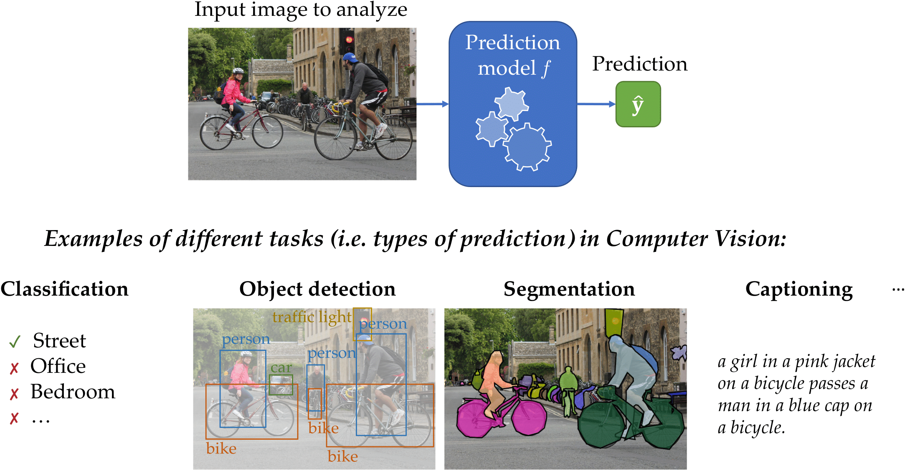</a><br>
	<a href="1_01_intro_CV.pdf"></a>
</p>

<p align="center">
	<strong>Intro of Machine Learning</strong>
</p>

<p align="center">
	<a href="1_02_intro_ML.png">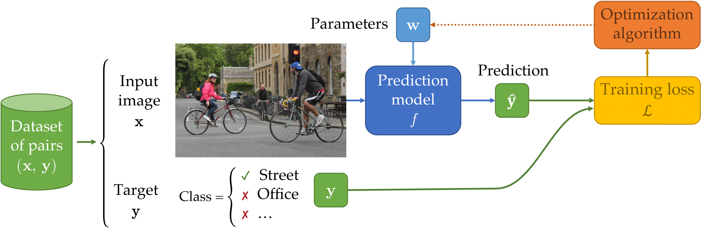</a><br>
	<a href="1_02_intro_ML.pdf"></a>
</p>

<p align="center">
	<strong>Intro of Neural Nets</strong>
</p>

<p align="center">
	<a href="1_03_neural_net.png">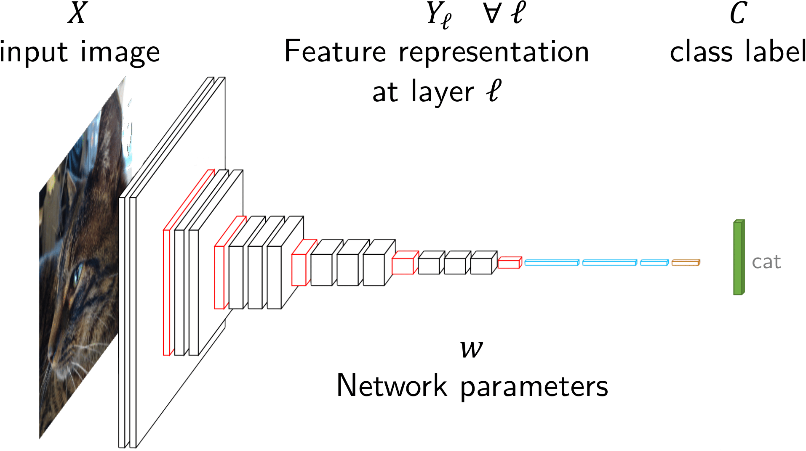</a><br>
	<a href="1_03_neural_net.pdf"></a>
</p>

<p align="center">
	<strong>Intro of ConvNets</strong>
</p>

<p align="center">
	<a href="1_04_intro_CNN.png"></a><br>
	<a href="1_04_intro_CNN.pdf"></a>
</p>

<p align="center">
	<strong>Intro of Disentangling</strong>
</p>

<p align="center">
	<a href="1_05_intro_disentangling.png">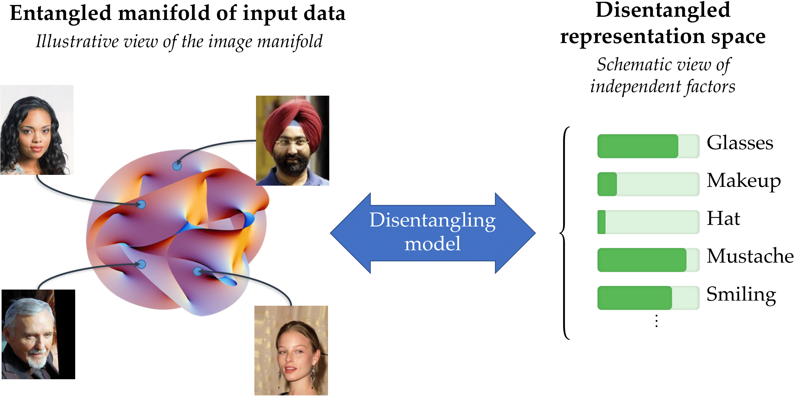</a><br>
	<a href="1_05_intro_disentangling.pdf"></a>
</p>

<p align="center">
	<strong>Famous ConvNets architectures</strong>
</p>

<p align="center">
	<a href="1_06_intro_archis.png">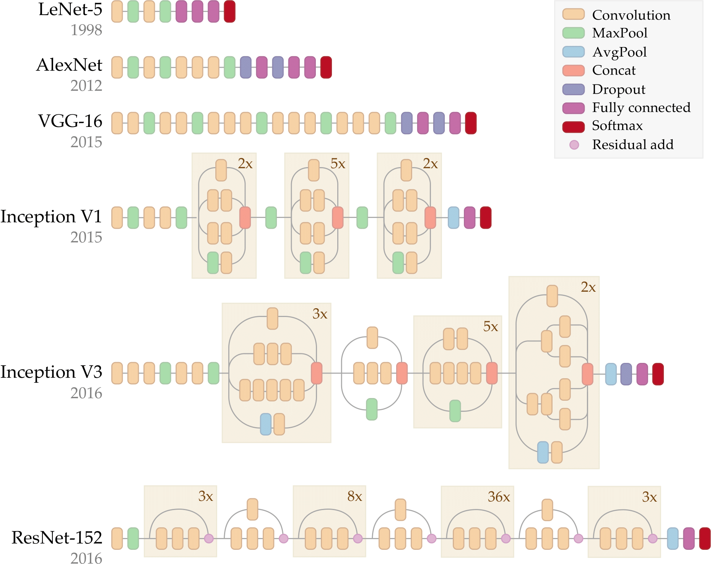</a><br>
	<a href="1_06_intro_archis.pdf"></a>
</p>

<p align="center">
	<strong>VGG architecture by [T. Durand](https://github.co</
	</durandtibo/deep_archi_latex)**

<p align="center">
	<a href="1_07_intro_VGG.png">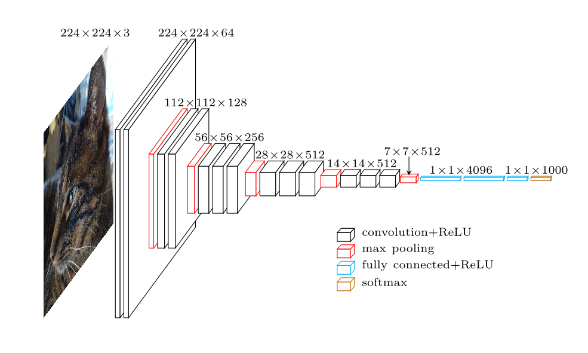</a><br>
	<a href="1_07_intro_VGG.pdf"></a>
</strong>

<p align="center">
	<strong>Illustration of Auto-Encoders</strong>
</durandtibo>

<p align="center">
	<a href="1_08_AE_auto_encoder.png">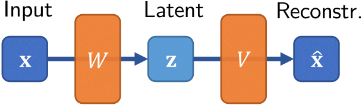</a><br>
	<a href="1_08_AE_auto_encoder.pdf"></a>
</p>

<p align="center">
	<strong>Illustration of Denoising Auto-Encoders</strong>
</p>

<p align="center">
	<a href="1_08_DAE_denosing_auto_encoder.png">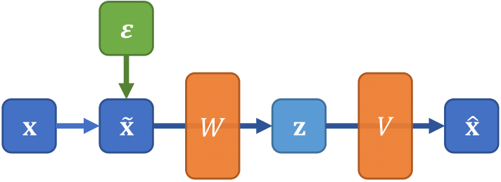</a><br>
	<a href="1_08_DAE_denosing_auto_encoder.pdf"></a>
</p>

<p align="center">
	<strong>Illustrations of Variational Auto-Encoders</strong>
</p>

<p align="center">
	<a href="1_09_VAE.png">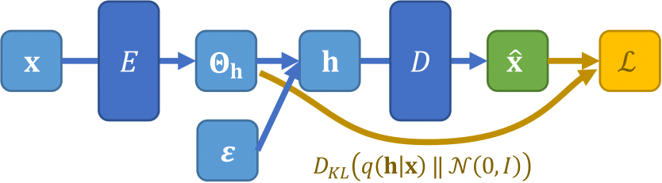</a><br>
	<a href="1_09_VAE.pdf"></a>
</p>

<p align="center">
	<a href="1_10_VAE_variations.png">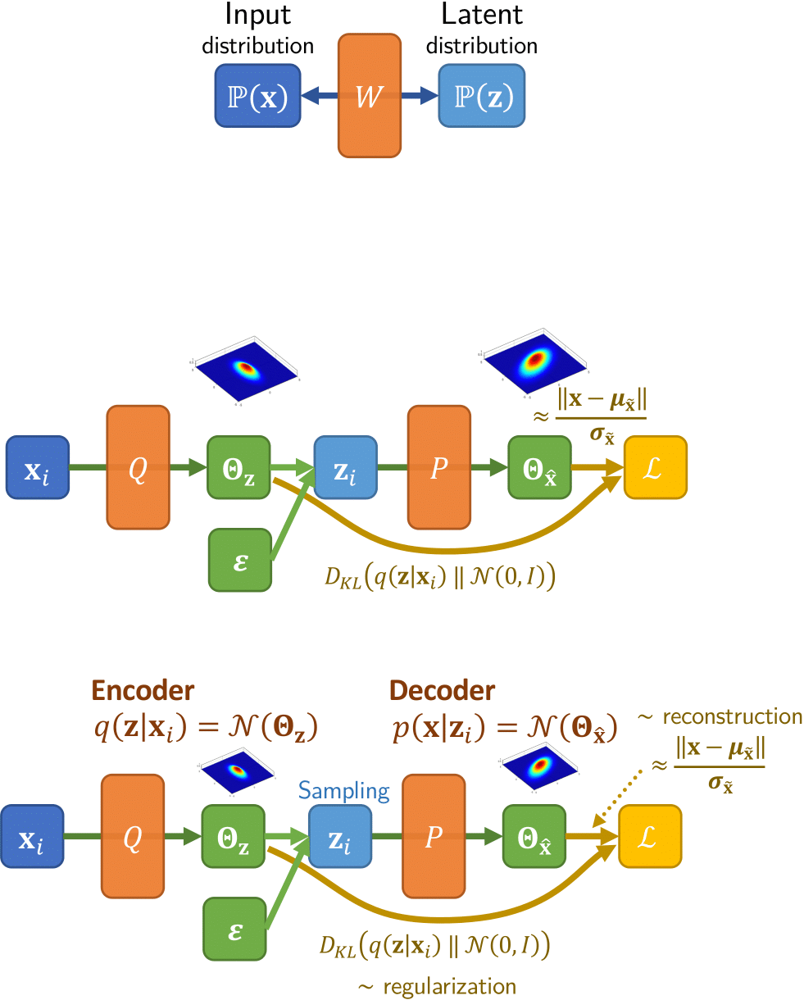</a><br>
	<a href="1_10_VAE_variations.pdf"></a>
</p>

<p align="center">
	<strong>Illustration of GAN</strong>
</p>

<p align="center">
	<a href="1_11_GAN.png">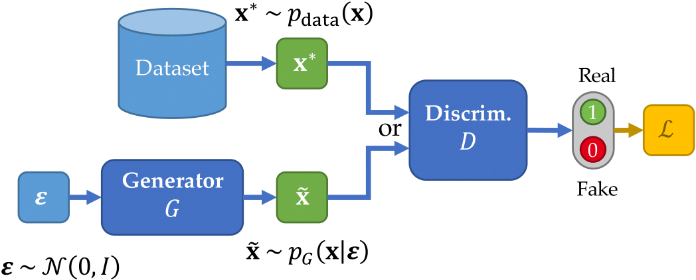</a><br>
	<a href="1_11_GAN.pdf"></a>
</p>

<p align="center">
	<strong>Illustration of Ladder Networks</strong>
</p>

<p align="center">
	<a href="1_12_LadderNetworks.png">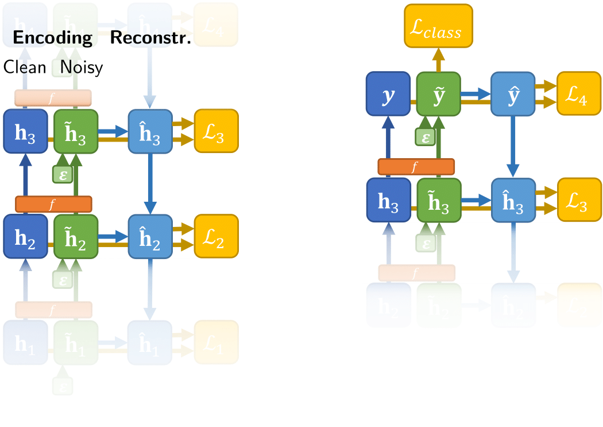</a><br>
	<a href="1_12_LadderNetworks.pdf"></a>
</p>

## [SHADE: Information-Based Regularization for Deep Learning](https://arxiv.org/abs/1805.05814)


<p align="center">
	<strong>Goal of the model</strong>
</p>

<p align="center">
	<a href="2_01_shade_motivation.png">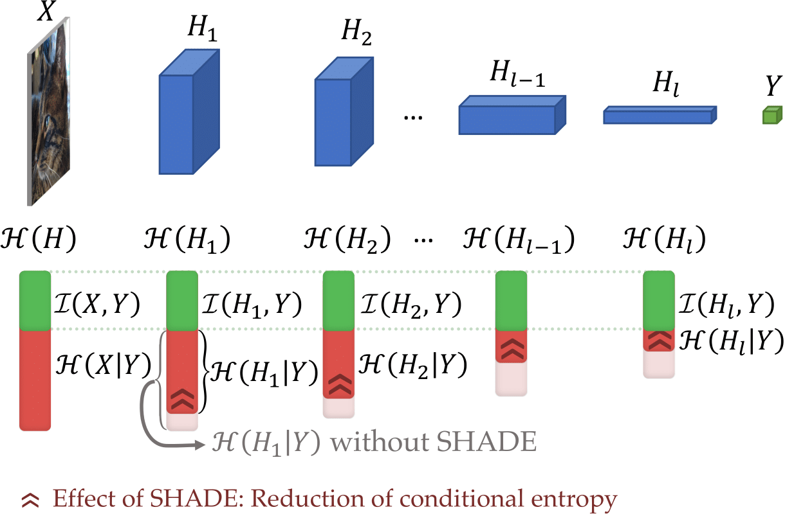</a><br>
	<a href="2_01_shade_motivation.pdf"></a>
</p>

<p align="center">
	<strong>Minimizing Entropy</strong>
</p>

<p align="center">
	<a href="2_02_shade_entropy.png">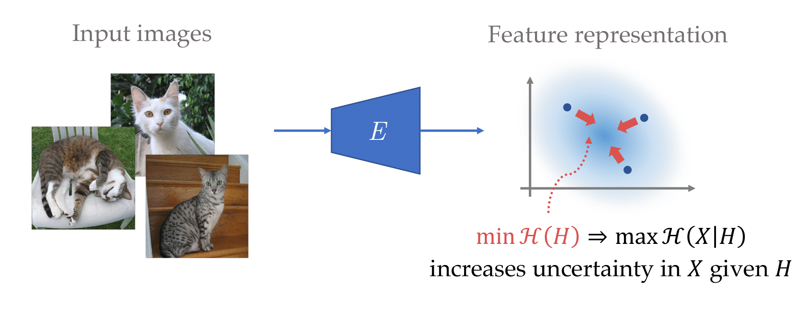</a><br>
	<a href="2_02_shade_entropy.pdf"></a>
</p>

<p align="center">
	<strong>Minimizing Conditional Entropy</strong>
</p>

<p align="center">
	<a href="2_03_shade_condentropy.png">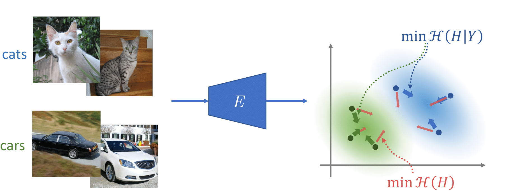</a><br>
	<a href="2_03_shade_condentropy.pdf"></a>
</p>

## [HybridNet: Classification and Reconstruction Cooperation for Semi-Supervised Learning](https://github.com/ThomasRobertFr/hybridnet)

<p align="center">
	<strong>Model overview</strong>
</p>

<p align="center">
	<a href="3_01_hybridnet_overview.png">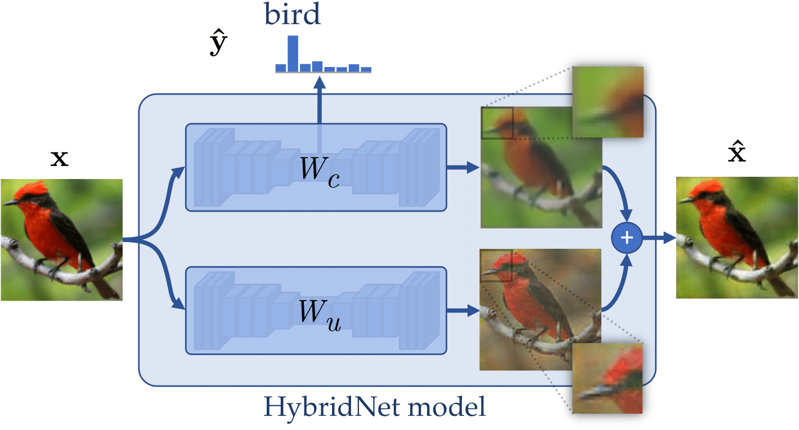</a><br>
	<a href="3_01_hybridnet_overview.pdf"></a>
</p>

<p align="center">
	<strong>Intuition</strong>
</p>

<p align="center">
	<a href="3_02_hybridnet_intuition.png">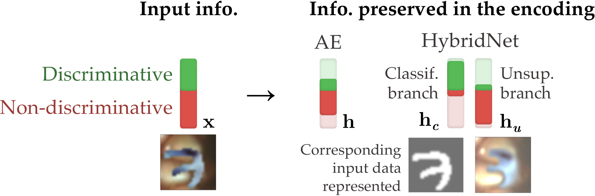</a><br>
	<a href="3_02_hybridnet_intuition.pdf"></a>
</p>

<p align="center">
	<strong>General architecture</strong>
</p>

<p align="center">
	<a href="3_03_hybridnet_general-archi.png">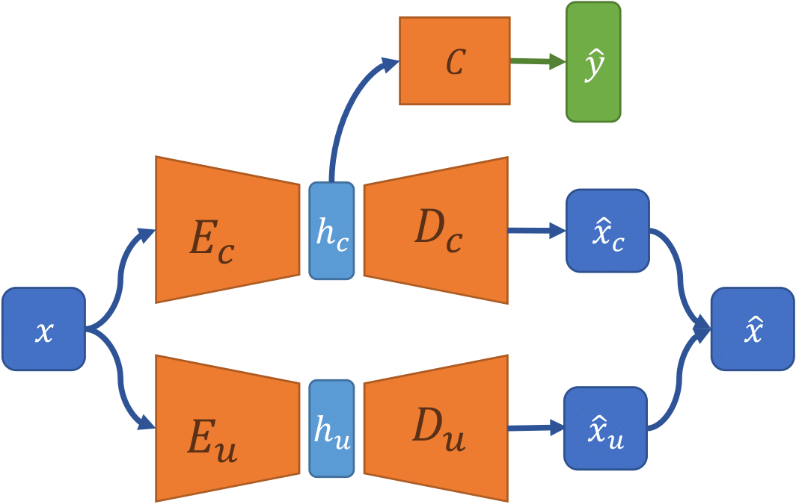</a><br>
	<a href="3_03_hybridnet_general-pdf"></a>
</p>

<p align="center">
	<strong>Losses</strong>
</p>

<p align="center">
	<a href="3_04_hybridnet_losses.png">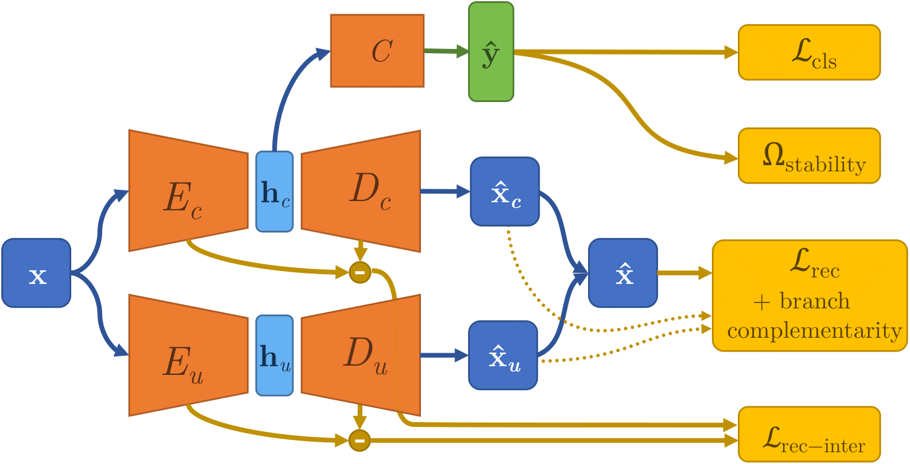</a><br>
	<a href="3_04_hybridnet_losses.pdf"></a>
</p>

<p align="center">
	<strong>ConvLarge architecture</strong>
</p>

<p align="center">
	<a href="3_05_hybridnet_convlarge.png">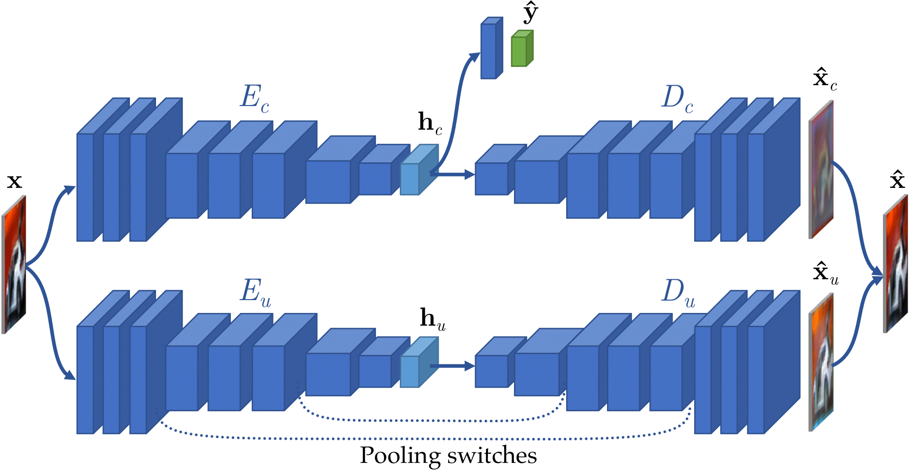</a><br>
	<a href="3_05_hybridnet_convlarge.pdf"></a>
</p>

<p align="center">
	<strong>Example of architecture</strong>
</p>

<p align="center">
	<a href="3_06_hybridnet_archi_example.png">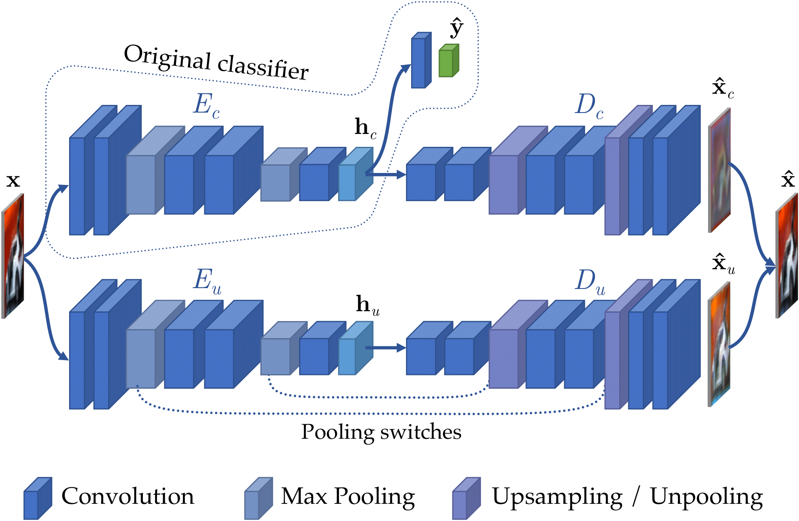</a><br>
	<a href="3_06_hybridnet_archi_example.pdf"></a>
</p>

<p align="center">
	<strong>Branch balancing effect</strong>
</p>

<p align="center">
	<a href="3_07_hybridnet_balacing.png">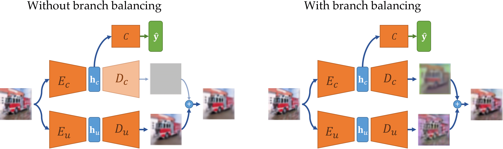</a><br>
	<a href="3_07_hybridnet_balacing.pdf"></a>
</p>

<p align="center">
	<strong>Merge strategies</strong>
</p>

<p align="center">
	<a href="3_08_hybridnet_merge_early.png">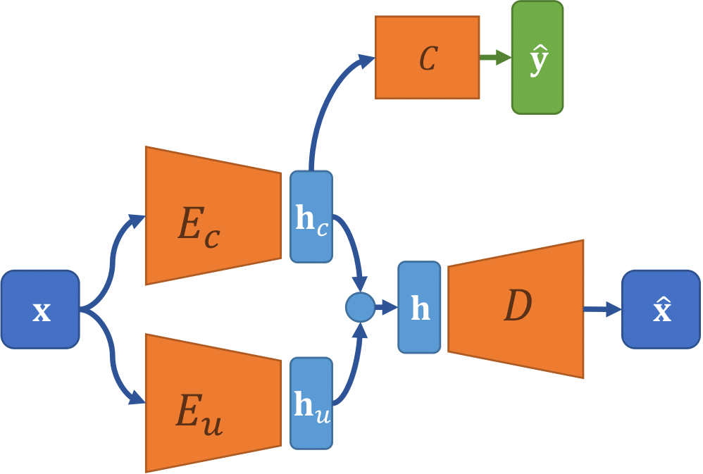</a><br>
	<a href="3_08_hybridnet_merge_early.pdf"></a>
</p>

<p align="center">
	<a href="3_09_hybridnet_merge_late.png">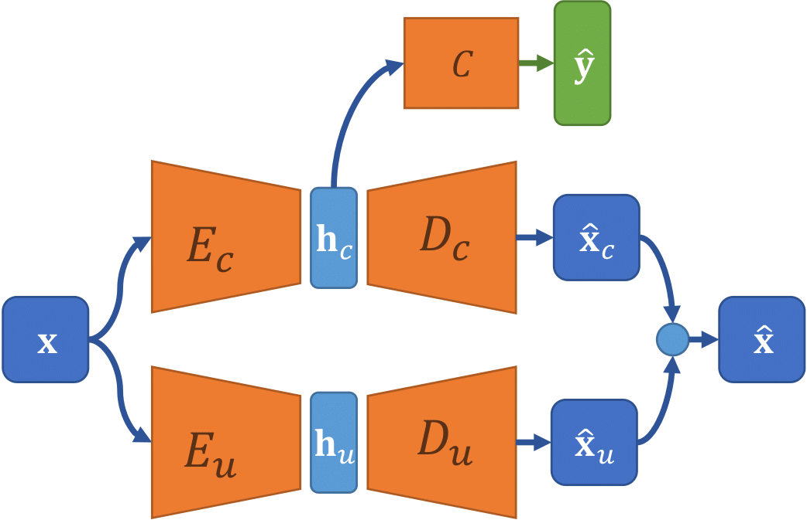</a><br>
	<a href="3_09_hybridnet_merge_late.pdf"></a>
</p>

<p align="center">
	<strong>HybridNet with SHADE</strong>
</p>

<p align="center">
	<a href="3_10_hybridnet_withshade.png">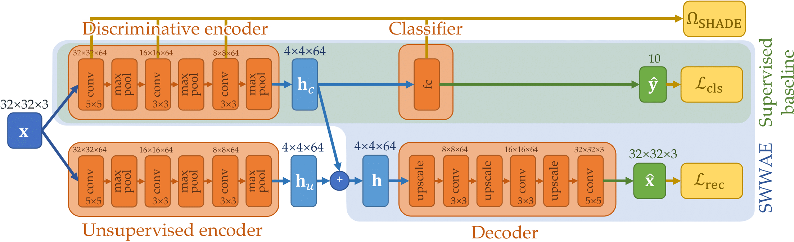</a><br>
	<a href="3_10_hybridnet_withshade.pdf"></a>
</p>

## [DualDis: Dual-Branch Disentangling with Adversarial Learning](https://arxiv.org/abs/1906.00804)

<p align="center">
	<strong>Overview</strong>
</p>

<p align="center">
	<a href="4_01_dualdis_intro.png">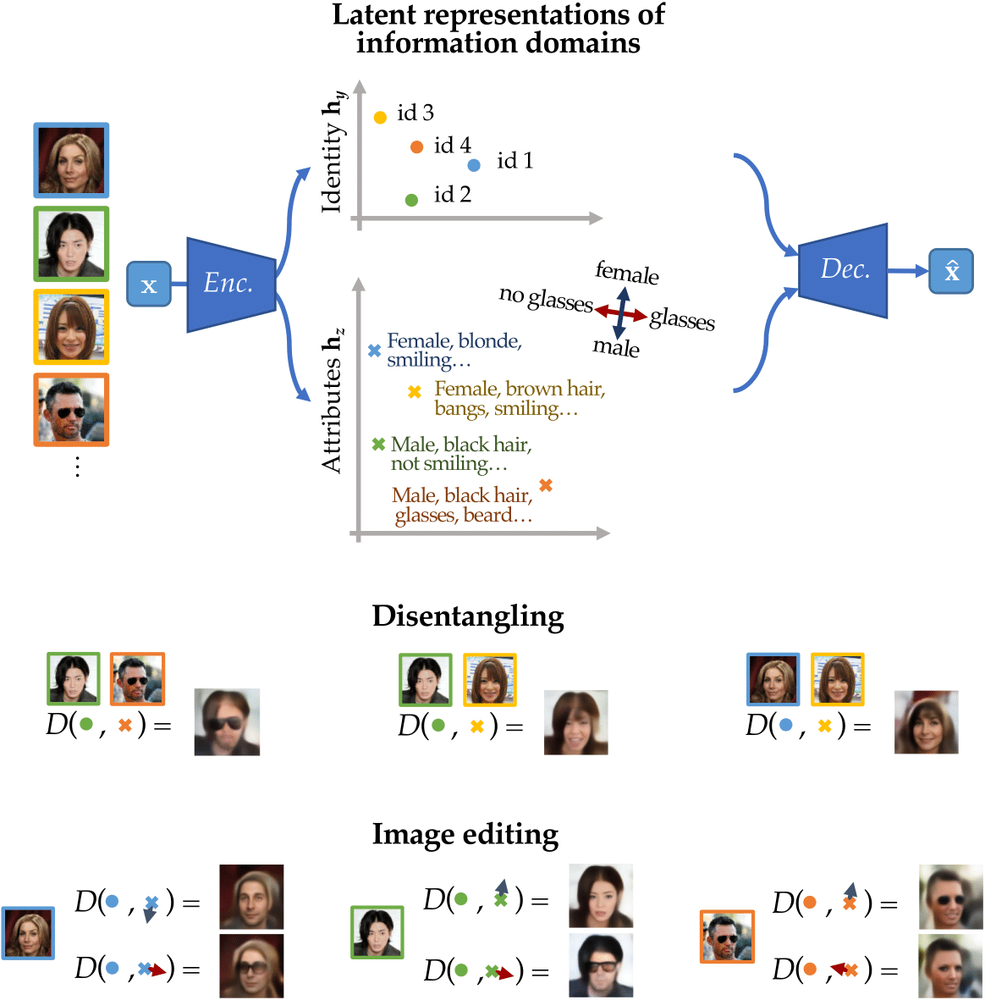</a><br>
	<a href="4_01_dualdis_intro.pdf"></a>
</p>

<p align="center">
	<strong>Architecture</strong>
</p>

<p align="center">
	<a href="4_02_dualdis_archi.png">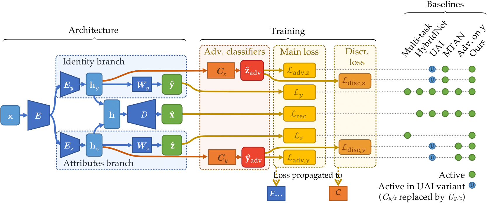</a><br>
	<a href="4_02_dualdis_archi.pdf"></a>
</p>

<p align="center">
	<strong>Comparison with other models</strong>
</p>

<p align="center">
	<a href="4_03_dualdis_archis_details.png">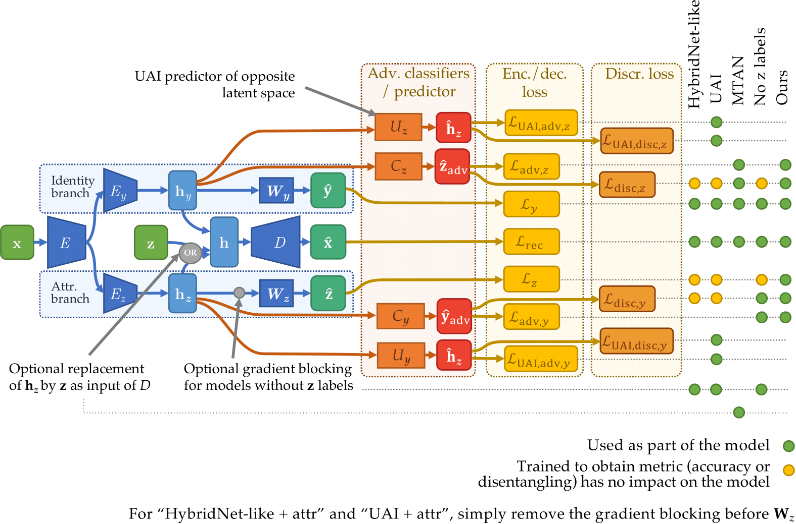</a><br>
	<a href="4_03_dualdis_archis_details.pdf"></a>
</p>

