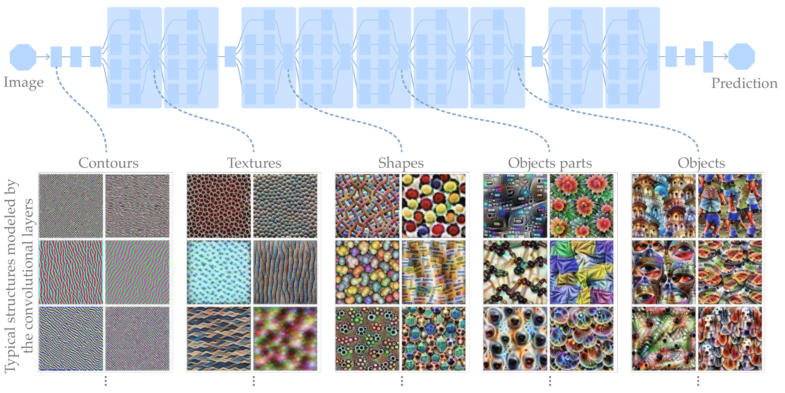

# Deep Learning Figures

These figures have been made mostly during [my PhD](https://www.thomas-robert.fr/en/resume/). Some present general concepts / models of Deep Learning, most are to describe the papers I worked on. The source is a [PPTX file containing all the figures](0_all_figures.pptx). You can try to adapt them to your needs if you feel up for it. If so, I recommend to install the [fonts](0_fonts) that I used.

These figures are used in [my PhD thesis](https://hal.archives-ouvertes.fr/tel-02309812) if you want to see them used in context and want a full legend.

<a property="dct:title" rel="cc:attributionURL" href="https://github.com/ThomasRobertFr/deep-learning-figures">Deep Learning Figures</a> by <a rel="cc:attributionURL dct:creator" property="cc:attributionName" href="https://www.thomas-robert.fr">Thomas Robert</a> is licensed under <a href="http://creativecommons.org/licenses/by-nc-sa/4.0/?ref=chooser-v1" target="_blank" rel="license noopener noreferrer" style="display:inline-block;">CC BY-NC-SA 4.0</a>

## Images

### General figures

**Intro of Computer Vision**

[PNG](1_01_intro_CV.png) [PDF](1_01_intro_CV.pdf)

**Intro of Machine Learning**

[PNG](1_02_intro_ML.png) [PDF](1_02_intro_ML.pdf)

**Intro of Neural Nets**

[PNG](1_03_neural_net.png) [PDF](1_03_neural_net.pdf)

**Intro of ConvNets**

[PNG](1_04_intro_CNN.png) [PDF](1_04_intro_CNN.pdf)

**Intro of Disentangling**

[PNG](1_05_intro_disentangling.png) [PDF](1_05_intro_disentangling.pdf)

**Famous ConvNets architectures**

[PNG](1_06_intro_archis.png) [PDF](1_06_intro_archis.pdf)

**VGG architecture by [T. Durand](https://github.com/durandtibo/deep_archi_latex)**

[PNG](1_07_intro_VGG.png) [PDF](1_07_intro_VGG.pdf)

**Illustration of Auto-Encoders**

[PNG](1_08_AE_auto_encoder.png) [PDF](1_08_AE_auto_encoder.pdf)

**Illustration of Denoising Auto-Encoders**

[PNG](1_08_DAE_denosing_auto_encoder.png) [PDF](1_08_DAE_denosing_auto_encoder.pdf)

**Illustrations of Variational Auto-Encoders**

[PNG](1_09_VAE.png) [PDF](1_09_VAE.pdf)

[PNG](1_10_VAE_variations.png) [PDF](1_10_VAE_variations.pdf)

**Illustration of GAN**

[PNG](1_11_GAN.png) [PDF](1_11_GAN.pdf)

**Illustration of Ladder Networks**

[PNG](1_12_LadderNetworks.png) [PDF](1_12_LadderNetworks.pdf)

### [SHADE: Information-Based Regularization for Deep Learning](https://arxiv.org/abs/1805.05814)

**Goal of the model**

[PNG](2_01_shade_motivation.png) [PDF](2_01_shade_motivation.pdf)

**Minimizing Entropy**

[PNG](2_02_shade_entropy.png) [PDF](2_02_shade_entropy.pdf)

**Minimizing Conditional Entropy**

[PNG](2_03_shade_condentropy.png) [PDF](2_03_shade_condentropy.pdf)

### [HybridNet: Classification and Reconstruction Cooperation for Semi-Supervised Learning](https://github.com/ThomasRobertFr/hybridnet)

**Model overview**

[PNG](3_01_hybridnet_overview.png) [PDF](3_01_hybridnet_overview.pdf)

**Intuition**

[PNG](3_02_hybridnet_intuition.png) [PDF](3_02_hybridnet_intuition.pdf)

**General architecture**

[PNG](3_03_hybridnet_general-archi.png) [PDF](3_03_hybridnet_general-archi.pdf)

**Losses**

[PNG](3_04_hybridnet_losses.png) [PDF](3_04_hybridnet_losses.pdf)

**ConvLarge architecture**

[PNG](3_05_hybridnet_convlarge.png) [PDF](3_05_hybridnet_convlarge.pdf)

**Example of architecture**

[PNG](3_06_hybridnet_archi_example.png) [PDF](3_06_hybridnet_archi_example.pdf)

**Branch balancing effect**

[PNG](3_07_hybridnet_balacing.png) [PDF](3_07_hybridnet_balacing.pdf)

**Merge strategies**

[PNG](3_08_hybridnet_merge_early.png) [PDF](3_08_hybridnet_merge_early.pdf)

[PNG](3_09_hybridnet_merge_late.png) [PDF](3_09_hybridnet_merge_late.pdf)

**HybridNet with SHADE**

[PNG](3_10_hybridnet_withshade.png) [PDF](3_10_hybridnet_withshade.pdf)

### [DualDis: Dual-Branch Disentangling with Adversarial Learning
](https://arxiv.org/abs/1906.00804)

**Overview**

[PNG](4_01_dualdis_intro.png) [PDF](4_01_dualdis_intro.pdf)

**Architecture**

[PNG](4_02_dualdis_archi.png) [PDF](4_02_dualdis_archi.pdf)

**Comparison with other models**

[PNG](4_03_dualdis_archis_details.png) [PDF](4_03_dualdis_archis_details.pdf)

